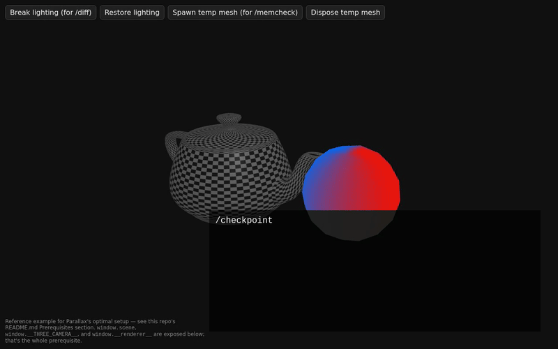

# Parallax Three.js

[](LICENSE)
[](https://www.npmjs.com/package/@propersloth/parallax-threejs)
[](https://github.com/propersloth/parallax-threejs/actions/workflows/ci.yml)
[](https://github.com/propersloth/parallax-threejs/actions/workflows/codeql.yml)

**Give Claude Code actual eyes on your three.js scene, so it stops guessing and starts diagnosing.**

You're building the three.js thing you've always wanted (a portfolio piece, a weird little game, some interactive art thing), mostly vibe-coding it with Claude. Going great, until something on screen looks *wrong* and you can't say why. You paste a screenshot. Claude guesses. You try the guess. Still broken. You paste another screenshot.

Not your fault. A screenshot is about the worst thing you can debug from: a black object could be an unlit material, a missing texture, a broken shader, or the camera clipping through it, and a picture alone can't tell those apart. Parallax gives Claude what you'd actually want: the real scene graph, the console, raw GPU state, and the pixels, checked against each other instead of one guess from one source.

That holds even when there's no screen to paste a screenshot from at all. This started because my Raspberry Pi's power supply couldn't keep up with rendering to a high-def display, so headless wasn't a feature choice, it was survival. I figured debugging by evidence instead of by eyeballing pixels would be slow going, groping forward in the dark. Instead it turned out faster: it just automated the cross-checking I was already doing by hand.

## Sound familiar?

- **"Where did it go?!"** Claude checks the scene graph (materials, transforms, shader compile status), the console (a silently failed texture load, maybe), and the pixels together, then tells you which one actually explains it.
- **"Did I actually just fix that?"** Run `/checkpoint` before and `/diff` after. You get a pixel diff, a console diff, and a scene-graph diff (plus a memory and perf draw-call/triangle delta, if you've exposed `window.__renderer__`), instead of two browser tabs and your own eyeballs.
- **"I am NOT taking seven screenshots for this."** `/export-report` renders the last `/diff` result as one self-contained HTML file: before/after/overlay screenshots, console diff, and scene/memory/perf deltas, all embedded inline, opening and reading correctly outside the chat session entirely.
- **"Please don't let me ship this broken."** `/ship-check` runs a Lighthouse accessibility/SEO/best-practices/agentic-browsing pass plus a Core Web Vitals trace, and tells you plainly what's blocking vs. a nice-to-have. It's a deliberate final pass, not something that fires mid-debugging-session.
- **"How many more reloads is this going to take?"** `/sweep` renders the whole range at once as a contact sheet, so you see every option side by side instead of bisecting by hand one slow reload at a time. It runs in the background too, so it's not holding the conversation hostage while it works.
- **"Am I even testing the same thing?"** `/replay` records the interaction once, including touch/mobile drags and taps, not just mouse, and reruns it exactly every time, so you're not left wondering if you hovered the same spot as last time.
- **"Did the bug move, or did the camera?"** `/sync-view` pins the camera to an exact, named framing, so a comparison is finally comparing the same shot.
- **"It compiled. That doesn't mean it's right."** The `shader-reviewer` subagent catches uniform and attribute mismatches, plus vertex/fragment drift a syntax checker can't see, before you even hit run.
- **"...and it's not stopping"** `/memcheck` checks for undisposed geometries/textures/materials on demand. Once a leak fix is confirmed, it can carry a memory expectation into the regression suite the same way a visual fix carries a pixel one, so it can't quietly come back.
- **"Tell me that's not back."** A git-SHA-indexed visual regression suite flags meaningful changes for your own review. Nothing gets auto-approved behind your back.

Built for solo devs and hobbyists vibe-coding a real three.js/WebGL project with Claude Code. If you're a professional game dev with your own engine and pipeline already, this probably isn't for you. It's scoped tightly and deliberately to vanilla three.js: no React Three Fiber, no framework detection, one stack, done well.

## Install

```
/plugin marketplace add propersloth/parallax-threejs
/plugin install parallax-threejs
```

Prefer installing through npm instead? Same marketplace, different plugin name:

```
/plugin marketplace add propersloth/parallax-threejs
/plugin install parallax-threejs-npm@propersloth
```

Same plugin either way, just updated via the npm registry instead of this git repo directly. Both of these are commands you type directly into a Claude Code session, not a URL to open in a browser.

## Prerequisites

- **A vanilla three.js project.** No React Three Fiber. See the opening of `AGENTS.md` if you're curious why the scope stays this narrow on purpose.
- **Your scene exposed on `window`.** This is how every debug tool finds anything at all — a common three.js debugging convention, not something Parallax invented, but it won't happen on its own:

  ```js
  window.scene = scene;               // required — everything depends on this
  window.__THREE_CAMERA__ = camera;   // optional — only /sync-view needs it
  window.__renderer__ = renderer;     // optional — enables memory/perf snapshots
  ```

  Only `window.scene` is required; the other two are opt-in and everything else works identically without them. `examples/teapot-demo/index.html` in this repo is a complete, real scene wired up exactly this way, if you'd rather see it running than in isolation.

  Missing `window.__THREE_CAMERA__` specifically: camera discovery falls back to scanning the scene graph for the first object with `.isCamera` set, which misses a camera that's constructed but never added as a scene child (an ordinary, valid pattern) — if `/sync-view` says "No camera found" even though your scene is fine, this is almost always why.
- **Node.js and Deno**, both on your system `PATH`:

  ```bash
  # Deno, macOS/Linux
  curl -fsSL https://deno.land/install.sh | sh
  ```
  ```powershell
  # Deno, Windows
  irm https://deno.land/install.ps1 | iex
  ```

  Node.js: grab it from [nodejs.org](https://nodejs.org) or your platform's package manager (`brew install node`, `apt install nodejs`, the Windows installer). Needed for the `npx`-based tools regardless of OS.

## Quick start

First, one-time setup in your actual project (not this repo):

```
/init
```

This copies the debug scripts and the visual regression harness into your project. Nothing above works without it. Safe to run more than once. It only fills in what's missing and never overwrites your own edits.

Now get your dev server running with `window.scene` exposed, and try:

```
/checkpoint before
```

That's a snapshot of the scene graph, console, and a screenshot, bundled together as one labeled unit. Now go make the change you were going to make anyway. Then:

```
/diff before
```

Instead of squinting at two screenshots, you get a real report: what moved, what didn't, whether any new console errors showed up, and how big the visual difference is. You decide whether that's the fix working or a regression. Parallax never makes that call for you.

That's the whole minimum setup. Here's what it actually looks like, end to end, against the bundled [teapot demo](examples/teapot-demo) scene:



*(Looping above for size — [full-quality .mp4](examples/teapot-demo/demo.mp4) if you want it sharper or slower.)*

```
> /checkpoint before
Checkpoint "before" saved — 5 objects, console clean, screenshot captured.

  [click "Spawn" in the browser — adds one temp mesh to the scene]

> /diff before
Since "before": 6 objects (+1 — the spawned mesh), a 3.6% pixel diff
concentrated where the new mesh appears, +1 draw call and +4096 triangles,
+1 geometry retained. No new console errors — the spawn worked as
expected, nothing unaccounted for.

> /export-report before
Saved .parallax/reports/2026-08-06T02-22-59-541Z-before.html — before/
after/overlay screenshots, the console diff, and this same delta, all in
one file you can open or share without pasting screenshots one at a time.
```

You don't have to drive it command-by-command, either. Say what you want in one prompt and Claude reaches for the same tools on its own — this is the "you generally won't call these by name" behavior described in [Your toolkit](#your-toolkit) below, shown against this exact scenario instead of just claimed:

```
> Checkpoint the scene as "before", then I'm going to click Spawn — diff
> it against "before" once I tell you I'm done, and export a shareable
> report.
Checkpoint "before" saved — 5 objects, console clean, screenshot captured.
Go ahead, I'll wait.

> done
Since "before": 6 objects (+1 — the spawned mesh), a 3.6% pixel diff
concentrated where the new mesh appears, +1 draw call and +4096
triangles, +1 geometry retained. No new console errors — the spawn
worked as expected. Report saved to
.parallax/reports/2026-08-06T02-25-17-902Z-before.html.
```

Two optional add-ons worth knowing about once you're past it:

- **[Recommended skills](docs/RECOMMENDED-SKILLS.md)**: general three.js/WebGL knowledge for Claude, on top of the debugging loop. Not bundled, genuinely optional.
- **[Recommended dependencies](docs/RECOMMENDED-DEPENDENCIES.md)**: a curated pick of physics, animation, and postprocessing libraries, if your project needs any of that.

Both of those, plus Spector setup, are also one guided command away instead of wiring them up by hand:

```
$ deno run -A <path-to-parallax-threejs-clone>/scripts/setup.ts

◆  Set up Spector for GL-state-level debugging?
◆  Physics engine?
◆  Animation / tweening library?
...
```

## Your toolkit

| Command | What it's actually for |
|---|---|
| `/init` | Run this first, once per project. Scaffolds everything below into your actual project. |
| `/checkpoint <label>` | Snapshot the scene graph, console, and a screenshot as one unit before you change anything. |
| `/diff <label>` | Compare right now against that snapshot: pixel diff, console diff, scene-graph diff, one report. |
| `/export-report [label]` | Render the last `/diff` result for a label as one self-contained, shareable HTML file. |
| `/sweep <object> <property> <range>` | Render every value in a range at once as a contact sheet, instead of testing values one at a time. |
| `/replay <scenario>` | Rerun a recorded interaction (hover, click, drag) exactly, instead of doing it by hand again. |
| `/sync-view <name>` | Snap the camera to an exact, reusable framing so comparisons stay honest. |
| `/memcheck [object]` | On-demand check for undisposed geometries/textures/materials, without waiting for a symptom. |
| `/ship-check` | Deliberate, on-demand pre-ship pass — Lighthouse accessibility/SEO/best-practices/agentic-browsing plus a Core Web Vitals trace. |

Behind these, three specialized subagents handle the heavier diagnostic work automatically: `shader-reviewer` catches shader bugs before they ever run, `visual-debugger` correlates all four evidence channels when something's actively wrong, and `scenario-author` turns a confirmed fix into permanent regression coverage. You generally won't call these by name; Claude reaches for the right one based on what you're doing.

## Under the hood

Installing the plugin wires up four browser/GPU inspection tools automatically (chrome-devtools-mcp, threejs-devtools-mcp, playwright-mcp, and Spector for raw GL state), so you don't configure any of this by hand. The one exception is Spector, which needs a one-time build step (`scripts/setup-spector.sh`) if you want raw GL-state debugging specifically, since it's cloned and compiled rather than installed like the others. Skip it until you actually need it.

## Troubleshooting

- **GLSL diagnostics not showing up.** Check `/plugin` → Errors for a missing-binary message first. `shader_language_server` needs to be on your `PATH` separately from the plugin itself. Installed it via `cargo install` and it's still not found? Make sure `~/.cargo/bin` is on `PATH` for the process running Claude, not just your interactive shell. Those can differ.
- **TypeScript diagnostics not showing up.** The official LSP plugin doesn't ship a binary: `npm install -g typescript-language-server typescript`.
- **TypeScript LSP says "Could not find a valid TypeScript installation"** even though `typescript` is right there in your project. This is a Claude Code LSP-rooting quirk (it roots at your session's working directory, not the specific file's project), not a bug in this plugin or in `typescript-language-server` itself. Fix: make sure your session's working directory is the actual TypeScript project you need diagnostics for.
- **`/checkpoint` or `/sweep` can't resolve an object.** You're missing `window.scene = scene`. See Prerequisites above.
- **Spector tools missing.** Run `scripts/setup-spector.sh` once. It's a clone-and-build step, not an npm install, so it doesn't happen automatically.
- **Performance numbers look off on Raspberry Pi.** Read `AGENTS.md` §7a before trusting any FPS/timing number on that hardware specifically. It's a known GPU-pipeline quirk on that platform, not a bug here.
- **`parallax-threejs-stable` fails to install with `git@github.com: Permission denied (publickey)`.** This happens on any machine without SSH keys configured for GitHub, even when `git`/`gh` are fully authenticated over HTTPS otherwise — Claude Code's installer always attempts an SSH clone for this specific marketplace-entry type, with no automatic HTTPS fallback (the rolling `parallax-threejs` entry doesn't have this problem; only the tag-pinned `-stable` one does). Not something this repo can fix — it's Claude Code's own installer behavior. Workaround: `git config --global url."https://github.com/".insteadOf "git@github.com:"` (and the same for `ssh://git@github.com/`).
- **A real Chrome window pops open every session, unprompted.** Three servers in `.mcp.json` default to headed (visible) browsers upstream: `chrome-devtools-mcp` and `playwright-mcp` need `"--headless"` added to their `args`; `threejs-devtools-mcp` is unrelated code with its own separate mechanism — it opens `localhost:9222` via a plain OS `xdg-open` call rather than a Puppeteer-launched browser, so it needs `"HEADLESS": "true"` added to its `env` instead (an `args` flag does nothing there). Versions of `.mcp.json` scaffolded before this was fixed are missing one or both. `/init` never overwrites an existing `.mcp.json`, so re-running it won't pick up the fix — edit your project's own `.mcp.json` by hand. (Skip this if you're on the Raspberry Pi example config — that one runs headed on purpose; see `AGENTS.md` §7a.)

## Learn more

`AGENTS.md` is the complete instruction set Claude reads when this plugin is active: every routing rule, the evidence-correlation discipline behind the debug loop, all of it. This README is the pitch and the quick start; `AGENTS.md` is the real spec. Looking to contribute? See `CONTRIBUTING.md`.

## License

MIT. See [LICENSE](LICENSE).
