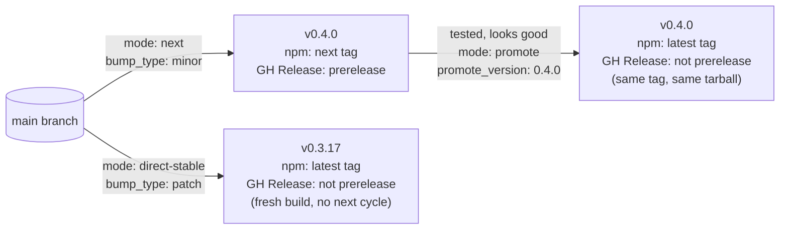

# Release Process

A worked, end-to-end walkthrough of cutting a release with this repo's
`release.yml` — for humans running it by hand from the Actions tab, and
for an agent asked to execute or explain a release. It's a reference,
not a script to run right now: every command and number below is a
concrete illustration, not an instruction to actually execute. Nothing
in this document should be carried out unless a human has explicitly
asked for that specific release to happen.

> [!NOTE]
> The version numbers used throughout (`0.3.16` → `0.4.0`) reflect this
> repo's actual state at the time this document was written. By the
> time you're reading this, the real numbers will be different — what
> matters is the *shape* of the process, not these specific digits.

## Overview: three modes, one decision per release

`release.yml` is a manual-only (`workflow_dispatch`) trigger with two
inputs that matter here: **`mode`** (which of the three operations
below) and **`bump_type`** (`patch`/`minor`/`major` — ignored by
`promote`). A third input, **`promote_version`**, is only used by
`promote`.

| Mode | What it does | When to use it |
|---|---|---|
| `next` | Fresh build, full test gate, bump version, tag, publish to npm under the `next` dist-tag, GitHub Release marked prerelease | You want to test a real, installable build before anyone's default install picks it up |
| `promote` | Take an *already-published* `next` release and relabel it stable — **no rebuild, no republish, no new version number** | The `next` build you just tested is good, and you want to ship exactly those bits, not a rebuild of them |
| `direct-stable` | Fresh build, full test gate, bump version, tag, publish to npm under `latest`, GitHub Release not marked prerelease | The change is small/low-risk enough that a separate testing cycle isn't worth the extra round trip |



The `parallax-threejs` marketplace entry (`"./"`, this repo, tracking
`main` directly) is unaffected by any of this — it always reflects
whatever's currently on `main`, which changes on every mode's version
bump regardless. It's the rolling/edge channel, not a stable one, by
construction (a same-repo relative-path marketplace source can't be
pinned to a ref at all). The `parallax-threejs-stable` entry — a
separate, explicit `github`-sourced entry pinned via `ref` — is the one
that actually stays put between releases, and only `direct-stable` or
`promote` move it.

---

## The canonical path: pre-release, verify, promote

This is the recommended path for anything you're not fully confident
shipping sight-unseen — which, realistically, is most releases.

### Step 0 — starting point

| | Value |
|---|---|
| `plugin.json` / `package.json` version | `0.3.16` |
| npm `latest` dist-tag | `0.3.16` |
| npm `next` dist-tag | *(none yet)* |
| `parallax-threejs-stable` marketplace entry | *(doesn't exist yet — no stable release has ever been cut through this pipeline)* |
| GitHub Releases | none cut via `release.yml` yet |

> [!WARNING]
> **This table assumes the package already has a real `latest` on npm from
> some prior publish** (the normal, ongoing case this walkthrough is written
> for) — under that condition, `next` genuinely leaves `latest` untouched, as
> the rest of this walkthrough describes.
>
> **A package's very first publish ever is a real exception, confirmed
> directly against the registry, not just documented behavior:** publishing
> `0.3.27` under `--tag next` for this package's actual first release also
> set `latest` to `0.3.27` — npm needs *some* version to serve a bare
> `npm install <pkg>` from, and with zero prior history there's nothing else
> for it to point at. This only happens once, on truly the first publish; it
> does not recur on later `next` cuts once any version has ever been
> published (that's the normal case this table depicts). Practically: on a
> brand-new package's first-ever release, there is no npm-side "untested,
> not public yet" window the way this process gives you on every subsequent
> release — treat that first version with the same care you would a stable
> cut, or publish an intentionally-throwaway placeholder version first if
> you need a real pre-release window from day one.

### Step 1 — cut the pre-release

Actions → **Release** → **Run workflow**:

| Input | Value |
|---|---|
| `mode` | `next` |
| `bump_type` | `minor` |
| `promote_version` | *(leave blank — unused by this mode)* |

What happens, in order (see `release.yml`'s `release` job):

1. Full CI gate re-runs — type-check, format, lint, config-syntax
   validation, Lane 1 + Lane 2 tests, `plugin.json` schema validation.
   Never skipped, regardless of mode.
2. New version computed: `0.3.16` + minor bump → `0.4.0`.
3. `plugin.json`, `package.json`, and the `parallax-threejs` marketplace
   entry's version field all get `0.4.0`.
4. Commit `chore(release): v0.4.0 [skip ci]` pushed directly to `main`.
5. Git tag `v0.4.0` created and pushed.
6. GitHub Release `v0.4.0` created **with `--prerelease`**.
7. `npm publish --access public --provenance --tag next` — publishes
   `0.4.0` to the registry under `next`, not `latest`. Authenticates via
   npm Trusted Publishing (OIDC), not a token — see the Safety Notes
   below for why, and for `promote`'s different situation.

Resulting state:

| | Value |
|---|---|
| npm `latest` | still `0.3.16` — completely unaffected |
| npm `next` | `0.4.0` |
| GitHub Release `v0.4.0` | exists, marked **Pre-release** |
| `parallax-threejs-stable` entry | still doesn't exist |

### Step 2 — verify the pre-release

```bash
# Confirm the dist-tags moved the way you expect
npm view @propersloth/parallax-threejs dist-tags
# → { latest: '0.3.16', next: '0.4.0' }

# Actually install it, in a scratch directory — confirms the published
# tarball is real and correct, not just that the version number exists
mkdir /tmp/release-check && cd /tmp/release-check
npm install @propersloth/parallax-threejs@next
```

```bash
gh release view v0.4.0 --json isPrerelease,isLatest
# → {"isLatest":false,"isPrerelease":true}
```

> [!IMPORTANT]
> There is currently no marketplace entry pinned to the npm `next` tag
> (only `parallax-threejs-npm`, which has no version pin and resolves to
> whatever the `latest` dist-tag is). The only way to test a pre-release
> through Claude Code's own plugin install flow today is the rolling
> `parallax-threejs` (`"./"`) entry, since it tracks whatever's on
> `main` — which, immediately after Step 1, is this exact `0.4.0` build.
> A dedicated `parallax-threejs-next` npm-sourced entry (pinned to a
> `next`-matching range) would close this gap if pre-release testing via
> the marketplace itself becomes something you want — not built today.

### Step 3 — decide: iterate or promote

If testing surfaces a problem, **fix it and cut another `next` release**
— you cannot reuse `0.4.0` for the fix; that version number is
permanently attached to the build you just published, bug and all. A
follow-up `next` run (`bump_type: patch`, since it's a fix) produces
`0.4.1`, becomes the new current `next`, and `0.4.0` simply stops being
anyone's default. Repeat Step 2 against `0.4.1`.

If it's good, move on to Step 4 — and note *which exact version* you're
about to promote (`promote` will refuse to promote anything that isn't
the package's current `next` release, precisely to prevent promoting a
stale build by mistake here).

### Step 4 — promote to stable

Actions → **Release** → **Run workflow**:

| Input | Value |
|---|---|
| `mode` | `promote` |
| `bump_type` | *(ignored by this mode — leave at default)* |
| `promote_version` | `0.4.0` |

What happens (see `release.yml`'s `promote` job) — deliberately **no
build, no test gate, no new version**:

1. Validates `promote_version` was provided and looks like a plain
   `X.Y.Z` version.
2. Confirms `0.4.0` is actually the package's *current* `next` release
   (`npm view @propersloth/parallax-threejs dist-tags.next`) — fails
   loudly if it isn't, rather than promoting the wrong build.
3. Confirms git tag `v0.4.0` exists.
4. `npm dist-tag add @propersloth/parallax-threejs@0.4.0 latest` — moves
   the `latest` pointer. No new tarball is uploaded. **This step alone
   is allowed to fail** (`continue-on-error`) — see the Safety Notes
   below for why, and what happens when it does.
5. `parallax-threejs-stable` marketplace entry is created (first ever
   promotion) or updated, `ref` set to `v0.4.0` — the *same* tag from
   Step 1, not a new one. Runs regardless of step 4's outcome.
6. `gh release edit v0.4.0 --prerelease=false --latest` — the *existing*
   `v0.4.0` release is relabeled, not replaced. Also runs regardless.

Resulting state:

| | Value |
|---|---|
| npm `latest` | `0.4.0` |
| npm `next` | still `0.4.0` (untouched — harmless; the next `next` run will move it) |
| GitHub Release `v0.4.0` | marked **Latest**, no longer marked Pre-release |
| `parallax-threejs-stable` entry | exists, `ref: v0.4.0` |

### Step 5 — verify the stable release

```bash
npm view @propersloth/parallax-threejs dist-tags
# → { latest: '0.4.0', next: '0.4.0' }

npm install @propersloth/parallax-threejs
# → installs 0.4.0 with no @tag needed
```

```bash
gh release view v0.4.0 --json isPrerelease,isLatest
# → {"isLatest":true,"isPrerelease":false}
```

In a clean Claude Code session:

```
/plugin marketplace add propersloth/parallax-threejs
/plugin install parallax-threejs-stable@propersloth
```

Confirm the plugin actually loads — commands, agents, and MCP servers
visible — not just that the manifest parsed.

---

## Alternative path: `direct-stable`, no pre-release cycle

For a change small and low-risk enough that a separate testing round
trip isn't worth it — a documentation fix, a trivial config correction —
skip `next`/`promote` entirely:

Actions → **Release** → **Run workflow**:

| Input | Value |
|---|---|
| `mode` | `direct-stable` |
| `bump_type` | `patch` (or whatever actually fits the change) |
| `promote_version` | *(unused)* |

This runs the *same* build-test-bump-tag-publish sequence as `next` —
nothing about the mechanics differs — except the npm publish goes
straight to `--tag latest` and the GitHub Release is never marked
prerelease. There's no intermediate "tested as next" step; the first
time this exact build exists anywhere is the moment it's already stable.
That's the tradeoff: faster, but nothing outside CI ever saw it running
for real before it became everyone's default install.

---

## Safety notes

> [!WARNING]
> **npm publishes are close to permanent.** A fresh publish (`next` or
> `direct-stable`) has a short unpublish window (currently 24 hours),
> and even after unpublishing, that exact version number can never be
> reused. If a *stable* release turns out to be broken, the standard
> response is to **cut a fix forward** (a new patch version) — not to
> try to unpublish and reuse the same number. Decide this calmly now,
> not while a bad release is live.

> [!TIP]
> `promote` refusing to run against a version that isn't the package's
> current `next` release is a deliberate guard, not a limitation to work
> around — if you're trying to promote something else, that's a sign to
> stop and check what's actually published (`npm view <pkg> dist-tags`)
> before proceeding, not to bypass the check.

> [!WARNING]
> **`npm publish` (used by `next` and `direct-stable`) and `npm dist-tag
> add` (used by `promote`) now have two different authentication stories
> — this is a real asymmetry, not an oversight.**
>
> `npm publish` uses **npm Trusted Publishing (OIDC)** — no token at all,
> authenticated via the workflow's own `id-token: write` permission and a
> Trusted Publisher configured on the package's npmjs.com settings page
> (one-time, out of band, not in this repo). This replaced an `NPM_TOKEN`-
> based approach on 2026-08-01, after npm's own tightened 2FA-for-
> publishing policy made a working CI token impractical (the "bypass 2FA"
> option on granular access tokens either doesn't render or doesn't take
> effect, per multiple open npm CLI bug reports as of this writing).
>
> `npm dist-tag add` has **no OIDC support at all** — npm has stated no
> timeline for adding it. `promote`'s dist-tag step still tries an
> `NPM_TOKEN` if one exists, but is allowed to fail
> (`continue-on-error`): the rest of `promote` (un-marking the GitHub
> Release, creating/updating the stable marketplace entry) doesn't need
> npm auth and proceeds regardless. If it fails, the job prints the exact
> command to run yourself, interactively, from a machine with 2FA-enabled
> npm auth: `npm dist-tag add <pkg>@<version> latest`. This is a real,
> currently-open gap in npm's own tooling, not something fixable from
> this repo — revisit if npm ever adds OIDC dist-tag support.

---

## Quick reference

| | `next` | `promote` | `direct-stable` |
|---|---|---|---|
| Rebuilds/re-tests | Yes | **No** | Yes |
| `bump_type` used? | Yes | No (ignored) | Yes |
| `promote_version` used? | No | **Yes (required)** | No |
| New git tag? | Yes | No — reuses the `next` tag | Yes |
| New GitHub Release? | Yes, `--prerelease` | No — edits the existing one | Yes, not prerelease |
| npm dist-tag | `next` | `latest` (via `dist-tag add`, no republish) | `latest` (via fresh `publish`) |
| Moves `parallax-threejs-stable`? | No | Yes | Yes |
| Moves `parallax-threejs` (`"./"`)? | Always — it tracks `main`, regardless of mode | | |
